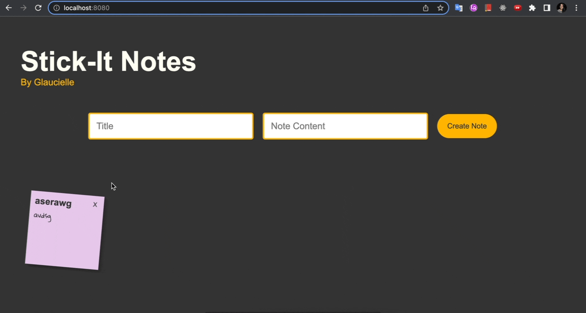

# Stick-it Notes

StickNotes is a project to learn the **localStorage** web storage API and practice DOM and CSS manipulation.

I worked with localStorage to manage sticknote storage and to do this I used **JSON stringify** to convert data to string as that is the required format to keep data in localStorage and then **JSON parse( )** to converts my data JSON string into a JavaScript object.

# Technologies 🏷️

# Features 💫

- Add note
- Keep the note even when the page is closed.
- Delete notes

# Future features ⏱️

- Implementation section: - I make - In progress - Done
- Drag and drop notes into the section.
- Be able to edit notes.
